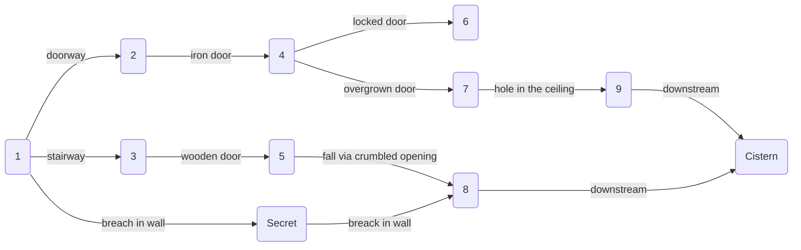

# Scene

On taking out the device from the earth a low grumble is heard.

A deadbridge goliath beetle is charging towards the party. It appears unstopable.

1 deadbridge goliath beetle
[sheet](https://www.dndbeyond.com/monsters/triceratops)

Escape should lead the party back through the way they came.
Beetle slams hard in the doorway behind them, shaking the walls where they ran.
Tunnel collapses in front, opening an alternative path, which they have not yet seen.

Path takes them slightly downward, before opening up in a chamber. Threat the following encounter as
a proper dungeon.

### R1

Small square room covered in darkness. Floor is covered in fungii and moss.
Walls are made from rough stone brick. Visible exits are: stair leading upward,
dark doorway and a careful adventurer can discover weak wall which can be taken
out with a kick.

### R2

Hall with strong collumns in the center, going further than anyone can see in the dark.
Walls are covered in small irregular holes and openings, which on inspection seem to lead
to some sort of tiny tunnel system, suitable for rodent sized creatures. A silky thread
can be seen here and there.

Walking down the corridor leads into spider webs which block passage. A skein spider
attacks the party for destroying the webs.

[sheet](https://www.dndbeyond.com/monsters/giant-spider)
[card](https://www.amazon.com/Magic-Gathering-Hatchery-Spider-Ravnica/dp/B07HKSLBRN)

Hall ends with an iron door.

### R3

Stairwell goes up in a spiral. Stairs are old and crumbled in places. Every
full circle a small landing is carved in the same stone. At the third landing
a rusty metal lever is perturbing from the wall. Pulling the lever makes a loud
metallic snap and a whirling of a chain in a mechanism behind the wall. No other
effects are visible. Fifth landing leads into another room through a wooden door.
Door crumbles on opening.

### R4

Behind a metal door a damp circular shaped corridor resides. Goes around some
big cylinder shaped stone structure which is cold and damp to the touch. Every
quarter of the circle a thick glass window opens up into what seems like a dark
aquarium. Something large is moving in the water behind the glass. There is a
total of three metal doors on the outer side of this corridor. One of the
remaining two doors are locked. Another is thickly covered in rust and needs to be
forcefully opened, because of growth behind it.
Rust can be DC 15 Intelligence(Nature) or Wisdom(Survival) checked to actually
be Russet Mold. Any creature within 5 feet of the door must make DC 13
Constitution saving throw. See [Russet Mold](https://www.dndbeyond.com/monsters/vegepygmy).

Final fourth door is hidden by illusion magic. It can only be detected by
casting detect magic. All other senses are blocked. Fourth door leads to the
surface via narrow passage which ends up behind a Ogre Café "Strongbrew".

### R5

Wooden door crumbles on touch and opens up to a study. Walls are covered in
tall charred wood shelves full of burned books. A strong smell of smoke
permeates what used to be a study. If a lever had been pulled, players see a
handful of smoke mephits darting in the darkness, they may have casted dancing
lights. Otherwise players see unnatural clouds of thick smoke hanging near the
ceiling.

[4 Smoke Mephit](https://www.dndbeyond.com/monsters/smoke-mephit)

Corner of the room is crumbled down, opening to a fall to a bellow cavern.

### R6

Locked door opens to a small study, which is clean and appears to have some
sort of magical enchantment runes above the door frame. Study seems unused for at least a while,
it is neat and orderly. There is mizzium equipment to be looted, no coin. Notes for a hybrid mechanic
water elemental can be found.

### R7

Iron door opens by great effort into a lush underworld garden. There is a sickly sweet smell in the air.
Movement between the large mushrooms is clear. A tribe of Vegepygmys attacks the trespassing party.

4 [Vegepygmy Tribesman](https://www.dndbeyond.com/monsters/vegepygmy)
1 [Thorny](https://www.dndbeyond.com/monsters/thorny)

Large metallic boulder covered in rust resides in the middle of the room (Russet Mold). It seems to have fallen through a hole
in the ceiling.

Only exit is the hole in the roof.

### R8

Party drops into a cavern with a small river below. A nest made from slightly melted stone sits on the bank.
Nest contains three red chitinous larva.

If players are not careful they are ferociously attacked by Ankheg.

1 [Ankheg](https://www.dndbeyond.com/monsters/ankheg)

After combat players can follow downstream. Upstream is blocked by a freshly installed metal gate.

### R9

A large cathedral like building with a broken ceiling and mostly crumbled
walls. Strong echo. Behind the altar a stream of water is gushing out into a
small brook which is directed through a broken grate. All other exits are
covered in debris. Players following downstream ends up in the Cistern.

### Secret

Broken wall opens up to a muddy tunnel. It seems like a tunnel made by a small
wurm. It is high enough to stand. One side of the tunnel ends up in a dead
end, another side goes uphill. After few curls and twists the tunnel touches
another slightly molten stone wall and turns to a muddy dead end. Stone wall
has cracks in it from the wurm touch. Broken wall opens up to a utility tunnel
with a stream flowing downward. Slightly uphill a freshly installed metal gate
resides.

### Cistern

Players remember the cistern where Neirius had led them before. They can backtrack to surface without incident.

scheme
graph G {
R1 -- R2 [label=doorway]
R1 -- R3 [label=stairway]
R1 -- RS [label="breach in wall"]

R2 -- R4 [label="iron door"]

R3 -- R5 [label="wooden door"]

R4 -- R6 [label="locked door"]
R4 -- R7 [label="rusty door"]

R5 -- R8 [label="fall via crumbled opening"]

R7 -- R9 [label="hole in the ceiling"]

RS -- R8 [label="breach in wall"]

R8 -- Cistern [label="downstream"]
R9 -- Cistern [label="downstream"]

}
scheme

